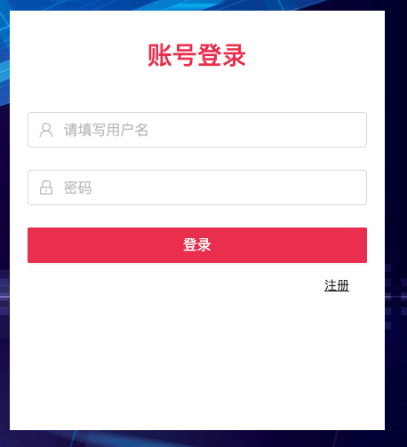
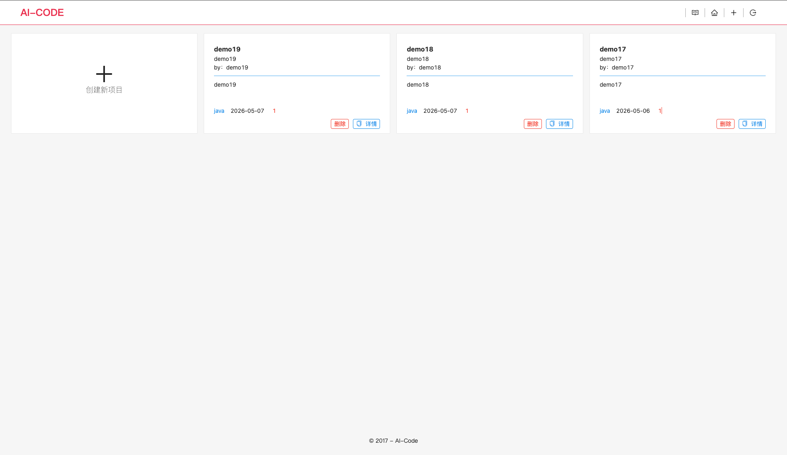
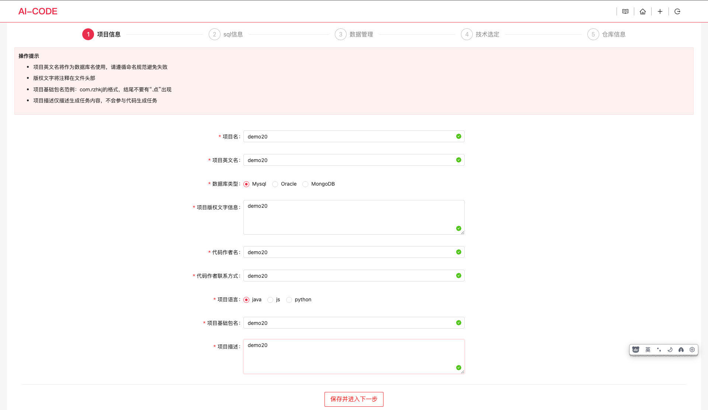
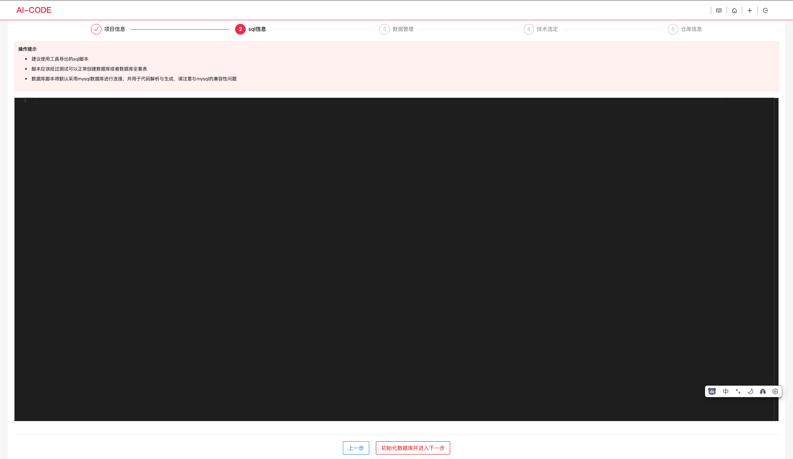
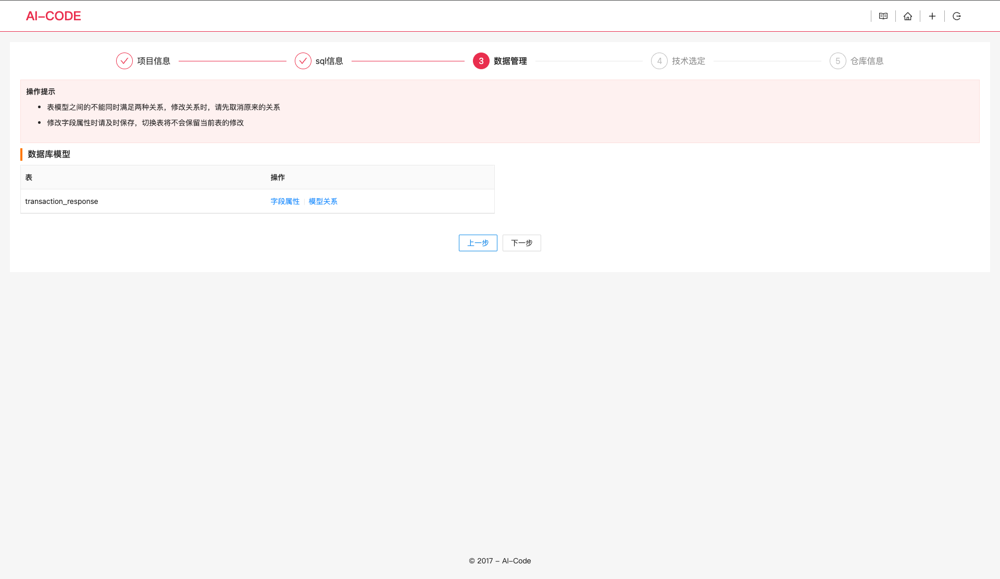
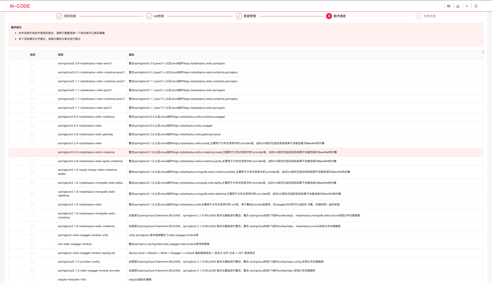
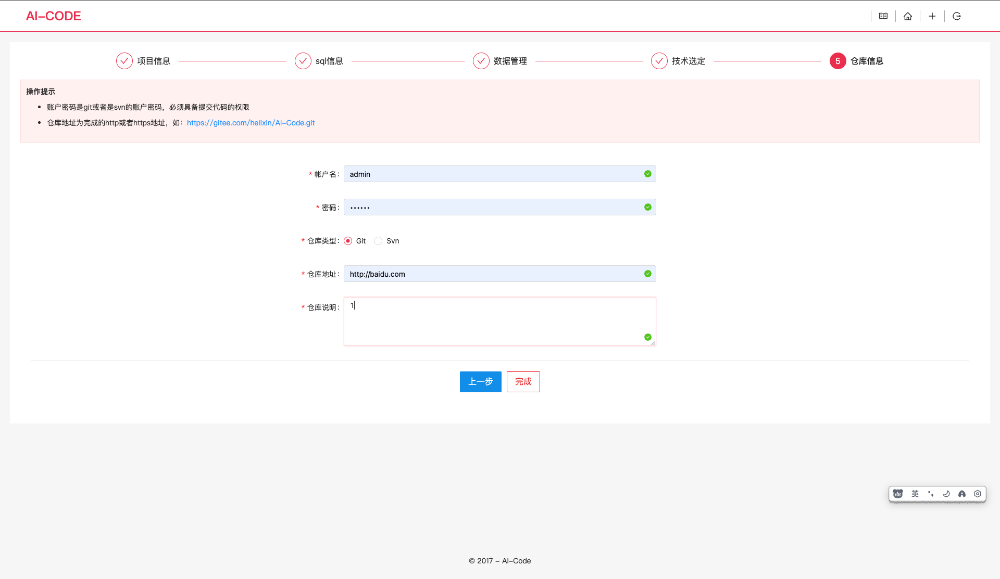
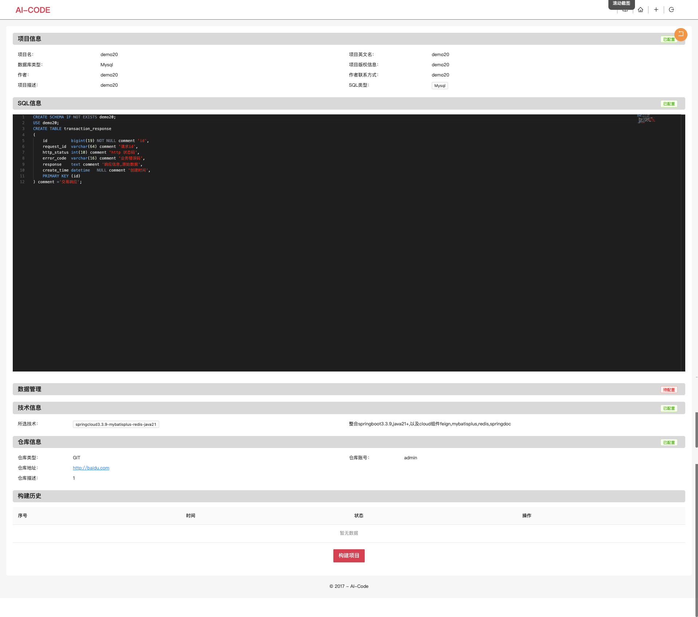
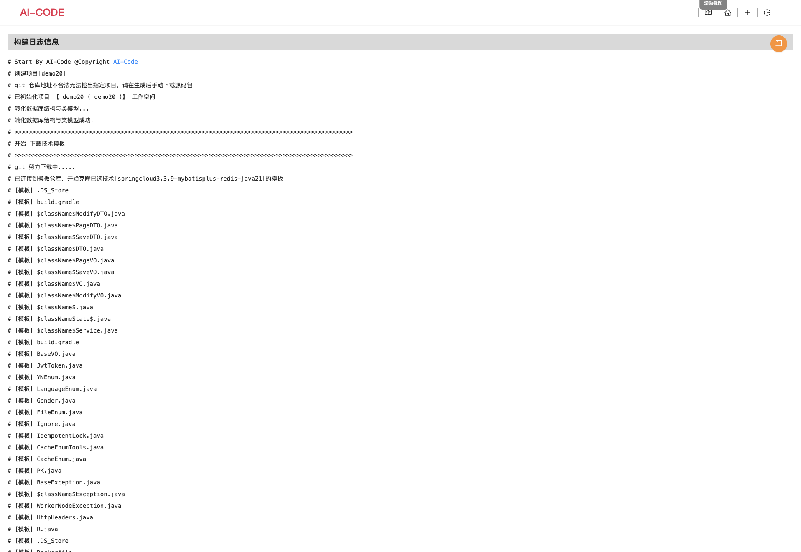

## 登录页 /login/signin

### 截图

### 功能说明

- 用户名+密码登录
- 登录成功后跳转 GET /project/list
- 失败显示错误提示

### 页面元素

- 用户名输入框 (placeholder: "请输入用户名")
- 密码输入框 (type: password)
- 登录按钮 (主色调: #009688)

### API调用

- POST /login/signin

## 项目列表页 /project/list

### 截图

### 功能说明

- 项目列表，通过方块布局显示
- 新版本页面变更：要求列表布局，添加按钮放在列表上方，删除，详情按钮放在最后一列

### 页面元素

- 第一个方块点击实现创建新项目页面，点击跳转页面，参考图：
- 删除按钮点击可以删除项目 ，点击后请求接口： DELETE /project/delete
- 详情点击可以进入详情页 , 弹框提醒是否删除，确认/取消, 点击确认后请求接口： GET /project/load

### API调用

- GET /project/list

## 第一步 项目信息

### 截图

### 功能说明

- 项目信息页面，创建新的项目的页面，可以录入信息，确认无误后点击 保存并进入下一步，会进入第二步

### 页面元素

- 项目名 （type: input）
- 项目英文名 (type: input)
- 数据库类型 (type: radio , value: mysql）
- 项目版权文字信息 (type: textarea)
- 代码作者名 (type: input)
- 代码作者联系方式 (type: input)
- 项目语言 (type: radio , value: java）
- 项目基础包名 (type: input)
- 项目描述 (type: textarea)
- 以上输入框都必须填写内容，不填写保存时提醒为空不能保存，填写后末尾增加一个绿色对号代表正确

### 跳转页面

- 下一步按钮 跳转到第二步页面 

### API调用

- POST /project/build

## 第二步 sql信息

### 截图

### 功能说明

- sql信息，有一个大的数据框，这个是使用了 Monaco Editor ，设置Sql样式，底部有一个按钮，初始化数据库并进入下一步

### 页面元素

- 输入sql的编辑器，采用 Monaco Editor

### 跳转页面

- 下一步按钮 跳转到第三步页面 

### API调用

- POST /project/sql/build
- POST /project/init

## 第三步 数据管理

### 截图

### 功能说明

- 上一步初始化sql后会有 表和类映射的数据可以查询，查询出来后列表显示，下方有两个按钮，上一步回到第二步，下一步进入第四步

### 页面元素

- 上一步按钮 点击回到上一步
- 下一步按钮 点击进入第四步

### 跳转页面

- 下一步按钮 跳转到第四步页面 

### API调用

- GET /framework/list

## 第四步 技术选定

### 截图

### 功能说明

- 第三步点击下一步进入当前页面，进来后，查询框架列表，并通过列表格式显示

### 页面元素

- 列表每一行第一列都有一个复选框，可以点击选择
- 页面底部有一个上一步按钮，点击回到第三步
- 下一步按钮，没选择点击提醒选择最少一条数据， 点击进入第五步 ，请求接口： POST /project/framwork/add

### 跳转页面

- 跳转到第五步页面 

### API调用

- GET /framework/list

## 第五步 仓库信息

### 截图

### 功能说明

- 这个页面可以填写git的仓库信息，录入账号，密码，选择git，仓库地址,仓库描述等 提交信息，后续构建业务时使用,点击完成可以保存数据，完成所有步骤

### 页面元素

- 帐户名 (type: input)
- 密码 (type: password)
- 仓库类型 (type: radio , git)
- 仓库地址 (type: input)
- 仓库说明 (type: textarea)
- 上一步，点击回到第四步
- 完成，点击完成可以保存数据，完成所有步骤，请求接口： POST /project/repository/build

### 跳转页面

- 点击完成后 跳转页面：，这个页面请求接口：GET project/load

### API调用

- POST /project/repository/build

## 构建项目详情页面

### 截图

### 功能说明

- 这页面是前面第一步到第五步的所有信息的展示，最下面后一个构建项目按钮，点以后进入构建流程，构建页面会通过websocket和后端连接监听日志消息
- 构建后页面上构建历史 可以显示构建的日志，点击查看日志可以看到日志详情
- 下载项目会有两个链接，下载源码:点击下载zip源码压缩包，查看源码：跳转页面可以网页上查看项目代码,请求接口：GET
  /project/scan/path

### 页面元素

- 构建项目 (type: button) 跳转页面

### 跳转页面

- 点击构建项目跳转页面 

### API调用

- 无

## 构建项目页面 /project/job/execute

### 截图

### 功能说明

- 页面进来后自动连接websocket，等待后端推送构建进度和日志
- 日志通过页面显示出来逐条显示

### 页面元素

- 代码已经提交到 ，会再构建完成时日志中显示，点击可以跳转git仓库
- 代码已打包ZIP ，点击可以下载压缩包
- 返回按钮，点击可以返回 构建项目详情页面

### 跳转页面

- 返回按钮，点击可以返回 构建项目详情页面 

### API调用

- GET /project/job/execute
- websocket /websocket

